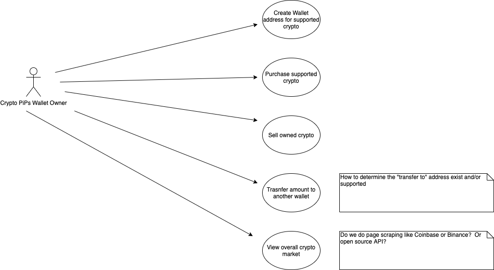
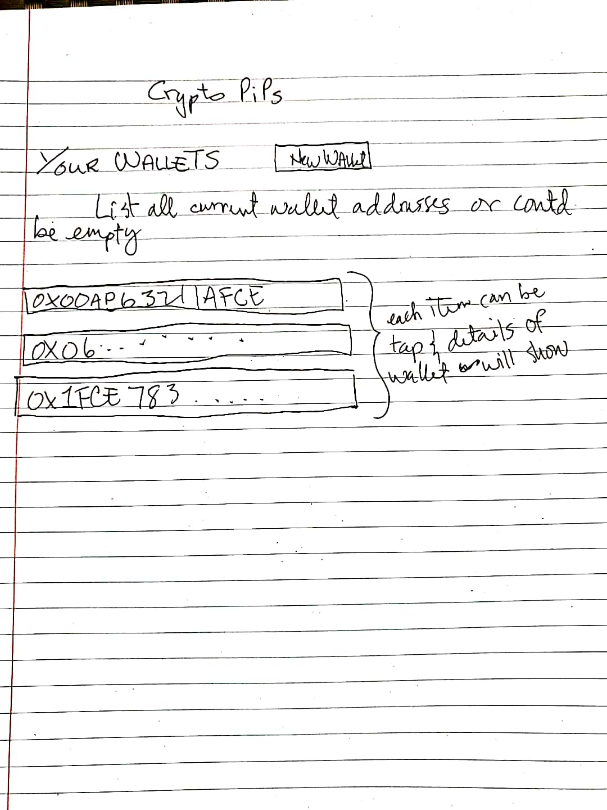
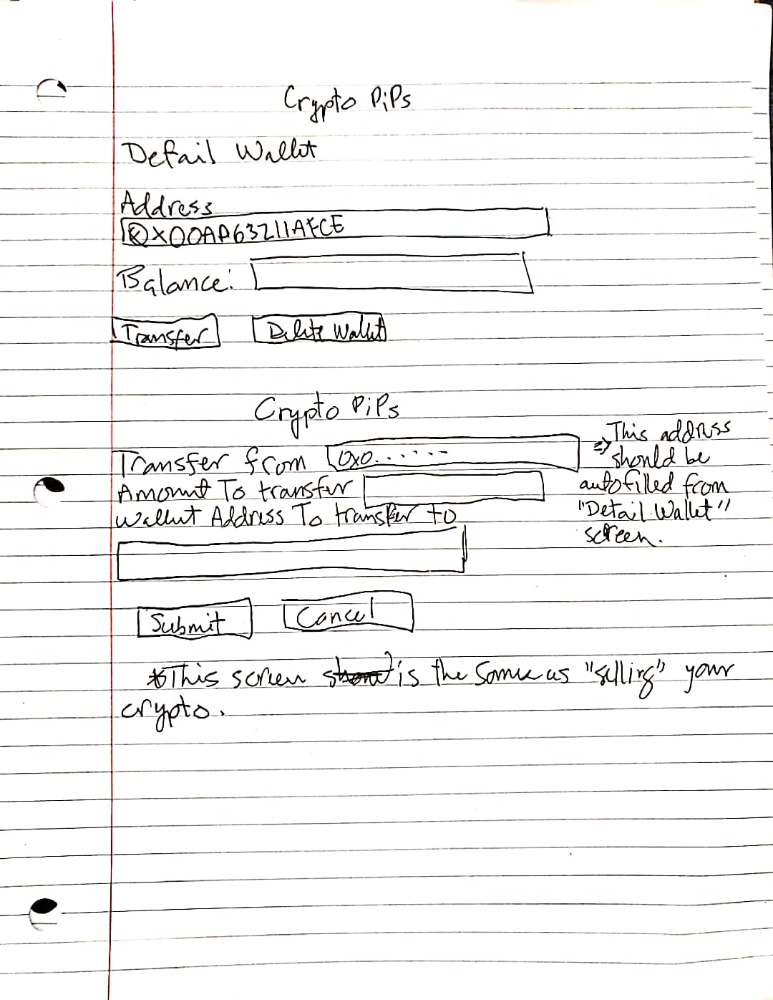
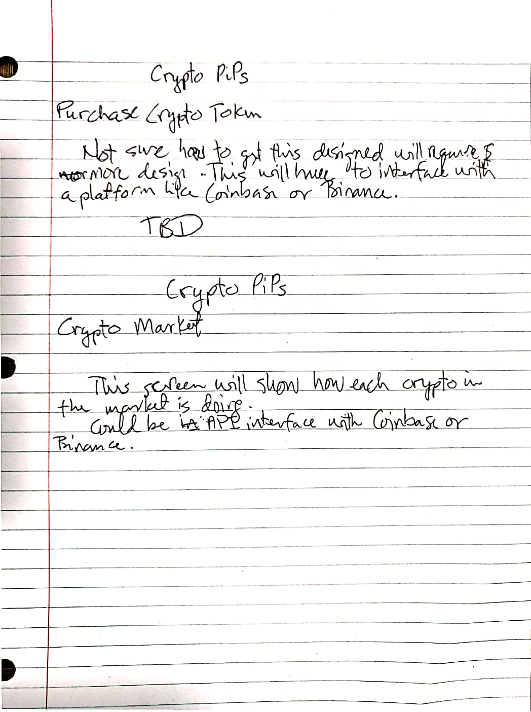

# Overview

Crypto PiPs is an attempt to create a general crypto currency wallet that contains wallet addresses for the different types of crypto currency assets on the Ethereum network       .  There are crypto wallets that supports the main stream crypto like ETH and Bitcoin.  This wallet is meant to support other non-mainstream crypto.  It's called "Crypto PiPs" because the initial thought is to own any crypto currency considered to be stable coins.

## Use Case Diagram

Below is a use case diagram to show the simple feature of the wallet

## Crypto Wallet User Screen Design on Paper

The screen design below list all wallet addresses created and owned by the wallet user

The screen design below shows the detail of each wallet.  It will show the balance of the wallet.  From here, the user can transfer to another wallet or delete the wallet.  The second screen in the image is for the user to transfer their balance to another wallet

The screen below will allow a user to purchase any tokens existing in the network.  This will require a bit more thought this is why there's no fields and field labels.  The second screen below will list out all crypto assets being traded.  Similar to a market dashboard.  This will also require more thoughts.  This may require a page scrape or an interface with an API with places like Coinbase or Binance

